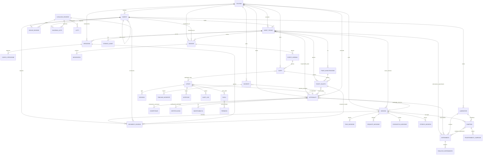
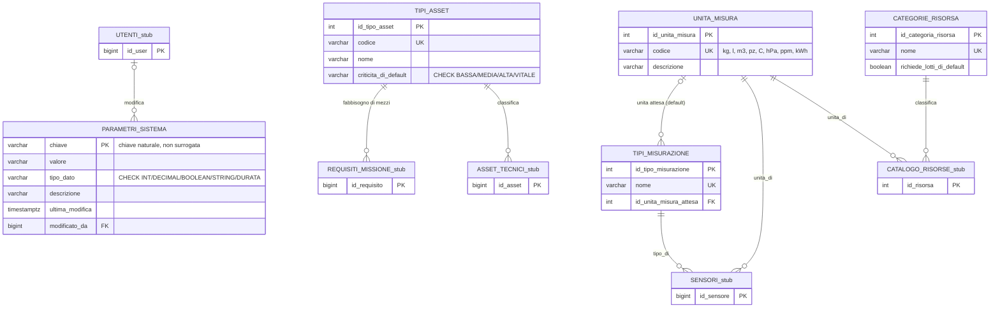
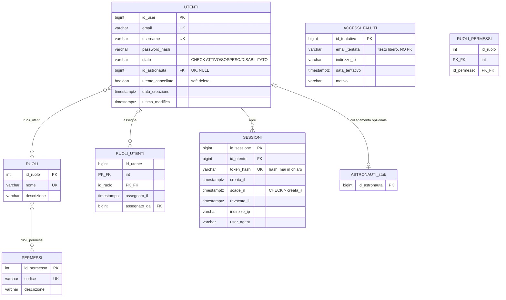
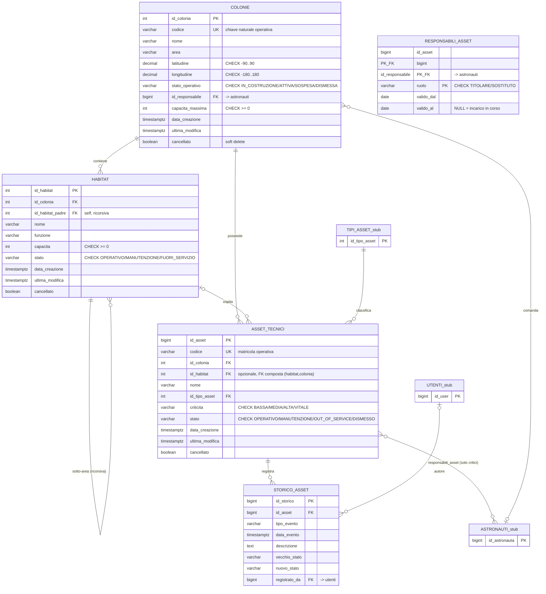
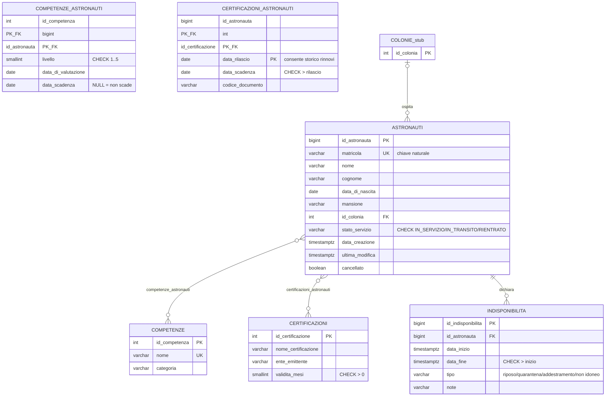

# AETHER — Modello Entità-Relazione completo

Ricostruito incrociando lo script SQL (`CREATE TABLE`, fonte di verità per colonne, tipi, PK/FK/CHECK) con il documento di progettazione Word (fonte per suddivisione in domini, cardinalità dichiarate, motivazioni). Lo schema conta **58 tabelle** più la vista `registro_consumi`, organizzate negli stessi 9 domini del documento (§2.1–§2.9).

Ogni diagramma è **autonomo**: le entità "esterne" al dominio (referenziate da FK ma definite altrove) compaiono come riquadro ridotto con i soli PK, per non spezzare la lettura delle relazioni. La definizione completa di ogni entità appare una sola volta, nel diagramma del proprio dominio.

Legenda cardinalità Mermaid: `||` uno esatto · `o|` zero o uno · `}o` zero o più · `}|` uno o più.

---

## 1. Diagramma d'insieme (solo entità e relazioni principali)



---

## 2. Dominio 2.1 — Tabelle di riferimento trasversali

Cataloghi condivisi da più domini (TIPI_ASSET, CATEGORIE_RISORSA, UNITA_MISURA, TIPI_MISURAZIONE, PARAMETRI_SISTEMA): valori aperti e destinati a crescere, quindi dati e non CHECK cablati.



**Note di progettazione (dal documento).** `CRITICITA_DI_DEFAULT` in `TIPI_ASSET` è solo un valore proposto in creazione, non vincolante sull'istanza (che ha il proprio `CRITICITA` in `ASSET_TECNICI`). `PARAMETRI_SISTEMA` usa la chiave naturale testuale come PK perché è letta per nome dal backend, non per identità relazionale (NFR-008).

---

## 3. Dominio 2.2 — Identità, account e autorizzazioni (IAM)

RBAC puro: `UTENTI` (identità applicativa) separata da `ASTRONAUTI` (persona fisica, dominio Equipaggio), collegate da una FK 1:1 opzionale. Autorizzazione a due livelli: RUOLI (grana grossa) + PERMESSI (grana fine) per il minimo privilegio.



**Note di progettazione.** `ACCESSI_FALLITI` registra `email_tentata` come testo libero e non come FK: un attaccante può provare email inesistenti, e una FK renderebbe impossibile tracciare proprio i tentativi più interessanti (IAM-008). `SESSIONI` memorizza solo l'hash del token, mai il token in chiaro, così come `password_hash` per `UTENTI` (stesso principio: un accesso in lettura al DB non deve permettere impersonificazione).

---

## 4. Dominio 2.3 — Colonie, habitat e asset tecnici

Il dominio più referenziato dell'intero schema: gerarchia fisico-funzionale `COLONIE → HABITAT (ricorsivo) → ASSET_TECNICI`.



**Note di progettazione (interventi rispetto alla bozza).** Eliminata la tabella ponte `COLONIE_HABITAT`: un modulo appartiene a una sola colonia (1:N, non N:N). `ID_HABITAT_PADRE` aggiunta per la gerarchia modulo/sotto-area. In `ASSET_TECNICI`, `ID_COLONIA` resta ridondante rispetto a `ID_HABITAT` (voluto: un rover può appartenere a una colonia senza modulo fisso); la coerenza tra i due è garantita da una **FK composta** `(id_habitat, id_colonia) → HABITAT` anziché da un controllo applicativo. `TIPO` convertito da VARCHAR libero a FK verso `TIPI_ASSET`.

---

## 5. Dominio 2.4 — Equipaggio, competenze e certificazioni



**Note di progettazione.** `STATO_SERVIZIO` sostituisce un booleano `DISPONIBILE` della bozza: la disponibilità reale non è un attributo della persona ma funzione del tempo (dipende da `INDISPONIBILITA` ed `EQUIPAGGIO_MISSIONE`), quindi va calcolata via query — tenerla come flag denormalizzato avrebbe violato BR-003. In `CERTIFICAZIONI_ASTRONAUTI`, `DATA_RILASCIO` entra nella PK per conservare lo storico dei rinnovi (BR-004 impone di valutare la validità alla data della missione, non a quella odierna).

---

## 6. Dominio 2.5 — Missioni e pianificazione

Il cuore operativo: mette in relazione equipaggio, asset e risorse. Concentra le regole di business più stringenti (BR-002, BR-003, BR-005, BR-013).

```mermaid
erDiagram
    MISSIONI {
        bigint id_missione PK
        varchar codice UK
        varchar obiettivo
        text descrizione
        int id_colonia FK
        int id_tipologia FK
        timestamptz data_inizio_prevista
        timestamptz data_fine_prevista "CHECK > inizio"
        varchar priorita "CHECK BASSA/MEDIA/ALTA/CRITICA"
        varchar rischio "CHECK BASSO/MEDIO/ALTO"
        varchar stato "CHECK 7 valori: DRAFT..CANCELLED"
        bigint id_responsabile FK "-> astronauti"
        bigint approvato_da FK "-> utenti, NULL"
        timestamptz data_approvazione
        timestamptz data_creazione
        timestamptz ultima_modifica
    }
    TIPOLOGIE_MISSIONE {
        int id_tipologia PK
        varchar nome UK
        boolean richiede_approvazione
    }
    TASK_MISSIONE {
        bigint id_task PK
        bigint id_missione FK "ON DELETE CASCADE"
        smallint numero "UK(id_missione,numero)"
        varchar obiettivo
        varchar stato "CHECK DA_FARE/IN_CORSO/COMPLETATO/ANNULLATO"
        timestamptz data_inizio
        timestamptz data_fine "CHECK >= inizio"
        bigint id_responsabile FK "-> astronauti"
    }
    REQUISITI_MISSIONE {
        bigint id_requisito PK
        bigint id_missione FK "ON DELETE CASCADE"
        int id_competenza FK "esclusivo con id_tipo_asset"
        smallint livello_minimo "CHECK 1..5"
        int id_certificazione FK
        int id_tipo_asset FK
        smallint quantita "CHECK > 0, default 1"
        varchar note
    }
    EQUIPAGGIO_MISSIONE {
        bigint id_missione PK_FK
        bigint id_astronauta PK_FK
        varchar ruolo "es. COMANDANTE; UK parziale: 1 solo comandante"
        timestamptz assegnato_il
    }
    ASSET_MISSIONE {
        bigint id_missione PK_FK
        bigint id_asset PK_FK
        varchar ruolo_impiego
        timestamptz assegnato_il
    }
    CONSUNTIVO_MISSIONE {
        bigint id_missione PK_FK "1:1 con missioni"
        varchar esito "CHECK SUCCESSO/SUCCESSO_PARZIALE/FALLIMENTO/ABORTITA"
        timestamptz data_inizio_effettiva
        timestamptz data_fine_effettiva "CHECK > inizio"
        text note
        bigint redatto_da FK "-> utenti"
        timestamptz data_chiusura
    }
    STORICO_MISSIONI {
        bigint id_storico PK
        bigint id_missione FK
        varchar campo_modificato
        varchar valore_precedente
        varchar valore_nuovo
        varchar motivazione "obbligatoria per ritorni di stato"
        timestamptz data_modifica
        bigint modificato_da FK "-> utenti"
    }
    COLONIE_stub { int id_colonia PK }
    ASTRONAUTI_stub { bigint id_astronauta PK }
    ASSET_TECNICI_stub { bigint id_asset PK }
    COMPETENZE_stub { int id_competenza PK }
    CERTIFICAZIONI_stub { int id_certificazione PK }
    TIPI_ASSET_stub { int id_tipo_asset PK }
    UTENTI_stub { bigint id_user PK }
    CAMPIONI_stub { bigint id_campione PK }
    MOVIMENTI_RISORSE_stub { bigint id_movimento PK }

    COLONIE_stub ||--o{ MISSIONI : sede
    TIPOLOGIE_MISSIONE ||--o{ MISSIONI : categorizza
    ASTRONAUTI_stub ||--o{ MISSIONI : "responsabile di"
    UTENTI_stub o|--o{ MISSIONI : approva
    MISSIONI ||--o{ TASK_MISSIONE : articola
    MISSIONI ||--o{ REQUISITI_MISSIONE : dichiara
    COMPETENZE_stub o|--o{ REQUISITI_MISSIONE : richiede
    CERTIFICAZIONI_stub o|--o{ REQUISITI_MISSIONE : richiede
    TIPI_ASSET_stub o|--o{ REQUISITI_MISSIONE : richiede
    MISSIONI }o--o{ ASTRONAUTI_stub : equipaggio_missione
    MISSIONI }o--o{ ASSET_TECNICI_stub : asset_missione
    MISSIONI o|--o| CONSUNTIVO_MISSIONE : chiude
    MISSIONI ||--o{ STORICO_MISSIONI : traccia
    MISSIONI ||--o{ CAMPIONI_stub : raccoglie
    MISSIONI ||--o{ MOVIMENTI_RISORSE_stub : consuma
```

**Note di progettazione (correzione più importante dello schema).** La bozza prevedeva quattro tabelle ponte parallele (COMPETENZE_MISSIONE, MEZZI_MISSIONE, ASSET_MISSIONI, ATTREZZATURE_MISSIONE) più un `REQUISITI_MISSIONE` generico con `TIPO` testuale, che violava l'integrità referenziale (BR-015). Sono state unificate in `REQUISITI_MISSIONE` con FK tipizzate e mutuamente esclusive (CHECK: esattamente una tra `id_competenza` e `id_tipo_asset` valorizzata). `STATO` sostituisce il booleano `APPROVATO` perché MIS-008 richiede sette stati distinti. Un indice UNIQUE parziale su `EQUIPAGGIO_MISSIONE(id_missione) WHERE ruolo='COMANDANTE'` impedisce a livello di database la doppia nomina di comandante.

---

## 7. Dominio 2.6 — Risorse, magazzino e rifornimenti

Governato da due regole rigide: ogni variazione di giacenza deriva da un movimento tracciato (BR-006) e la giacenza non può diventare negativa (BR-007).

```mermaid
erDiagram
    CATALOGO_RISORSE {
        int id_risorsa PK
        varchar codice UK
        varchar nome
        int id_categoria_risorsa FK
        int id_unita_misura FK
        boolean gestione_lotti "obbliga lotto+scadenza"
        boolean attivo "disattivazione logica"
        varchar descrizione
        timestamptz data_creazione
        timestamptz ultima_modifica
    }
    LOTTI {
        bigint id_lotto PK
        int id_risorsa FK
        varchar codice_lotto "UK(id_risorsa,codice_lotto)"
        varchar provenienza
        date data_scadenza
        date data_produzione
    }
    SOGLIE_RISORSE {
        int id_habitat PK_FK
        int id_risorsa PK_FK
        decimal soglia_minima "CHECK >= 0, default 0"
        timestamptz ultima_modifica
    }
    GIACENZA_LOTTI {
        int id_habitat PK_FK
        int id_risorsa PK_FK
        bigint id_lotto PK_FK "FK composta (lotto,risorsa)"
        decimal quantita_disponibile "CHECK >= 0 -- BR-007"
        timestamptz ultima_modifica
    }
    MOVIMENTI_RISORSE {
        bigint id_movimento PK
        int id_risorsa FK
        bigint id_lotto FK "FK composta (lotto,risorsa)"
        int id_habitat FK
        varchar tipo_movimento "CHECK CARICO/SCARICO/TRASFERIMENTO/CONSUMO/RETTIFICA"
        decimal quantita "CHECK <> 0, con segno"
        varchar causale
        bigint id_trasferimento "accoppia 2 righe stesso trasferimento"
        bigint id_spedizione FK
        bigint id_missione FK
        bigint id_ticket FK
        timestamptz data_movimento
        bigint registrato_da FK "-> utenti"
    }
    SPEDIZIONI {
        bigint id_spedizione PK
        varchar codice UK
        varchar origine_tipo "CHECK TERRA/COLONIA"
        int id_colonia_origine FK "NULL se da TERRA"
        int id_colonia_dest FK
        bigint id_asset_veicolo FK
        varchar stato "CHECK PIANIFICATA..ANNULLATA"
        timestamptz data_partenza
        timestamptz data_arrivo_prevista
        timestamptz data_arrivo_effettiva
    }
    CARICO_SPEDIZIONE {
        bigint id_spedizione PK_FK "ON DELETE CASCADE"
        int id_risorsa PK_FK
        bigint id_lotto PK_FK "FK composta (lotto,risorsa)"
        decimal quantita_trasportata "CHECK > 0"
        decimal quantita_ricevuta "CHECK >= 0"
    }
    REGISTRO_CONSUMI_VIEW {
        bigint id_movimento "vista, non tabella"
        int id_risorsa
        decimal quantita_consumata
        int id_colonia
        bigint id_missione
        timestamptz data_movimento
    }
    HABITAT_stub { int id_habitat PK }
    COLONIE_stub { int id_colonia PK }
    ASSET_TECNICI_stub { bigint id_asset PK }
    MISSIONI_stub { bigint id_missione PK }
    TICKET_GUASTO_stub { bigint id_ticket PK }
    UTENTI_stub { bigint id_user PK }

    CATALOGO_RISORSE ||--o{ LOTTI : ha
    HABITAT_stub ||--o{ SOGLIE_RISORSE : configura
    CATALOGO_RISORSE ||--o{ SOGLIE_RISORSE : per
    HABITAT_stub ||--o{ GIACENZA_LOTTI : deposita
    CATALOGO_RISORSE ||--o{ GIACENZA_LOTTI : per
    LOTTI ||--o{ GIACENZA_LOTTI : giacenza_di
    CATALOGO_RISORSE ||--o{ MOVIMENTI_RISORSE : movimenta
    LOTTI o|--o{ MOVIMENTI_RISORSE : movimenta
    HABITAT_stub ||--o{ MOVIMENTI_RISORSE : interessa
    SPEDIZIONI o|--o{ MOVIMENTI_RISORSE : genera
    MISSIONI_stub o|--o{ MOVIMENTI_RISORSE : consuma
    TICKET_GUASTO_stub o|--o{ MOVIMENTI_RISORSE : consuma_ricambi
    UTENTI_stub ||--o{ MOVIMENTI_RISORSE : registra
    COLONIE_stub o|--o{ SPEDIZIONI : origine
    COLONIE_stub ||--o{ SPEDIZIONI : destinazione
    ASSET_TECNICI_stub o|--o{ SPEDIZIONI : veicolo
    SPEDIZIONI ||--o{ CARICO_SPEDIZIONE : trasporta
    CATALOGO_RISORSE ||--o{ CARICO_SPEDIZIONE : contiene
    LOTTI ||--o{ CARICO_SPEDIZIONE : del_lotto
    MOVIMENTI_RISORSE ||--o{ REGISTRO_CONSUMI_VIEW : "filtrata su CONSUMO"
```

**Note di progettazione.** `QUANTITA` rimossa da `CATALOGO_RISORSE` (violava la 2NF: dipende dal luogo e dal lotto, non dalla risorsa) → introdotte `LOTTI` + quantità con segno nei movimenti. `SOGLIE_RISORSE` separata da `GIACENZA_LOTTI` in revisione: la soglia dipendeva solo da (habitat, risorsa), non dall'intera chiave (habitat, risorsa, lotto) — dipendenza parziale, violazione 2NF. `GIACENZA_LOTTI` è un **saldo derivato**: non scrivibile dall'applicazione, aggiornato solo dal trigger che accompagna l'inserimento in `MOVIMENTI_RISORSE` (BR-006); il CHECK di non negatività implementa BR-007 al livello non aggirabile. `REGISTRO_CONSUMI` è una **vista** (non una tabella, come nella bozza) sui movimenti di tipo `CONSUMO`, per non duplicare dati e non rischiare consumi senza movimento corrispondente.

---

## 8. Dominio 2.7 — Manutenzione e incidenti

Distinzione fondamentale: guasto tecnico su singolo asset (`TICKET_GUASTO`) vs. incidente operativo (`INCIDENTI`), che può coinvolgere persone, habitat e missioni e richiede escalation, root cause e chiusura autorizzata.

```mermaid
erDiagram
    PIANO_MANUTENZIONE {
        bigint id_piano PK
        bigint id_asset FK
        varchar titolo
        text descrizione
        varchar tipo_intervallo "CHECK TEMPO/UTILIZZO"
        int valore_intervallo "CHECK > 0"
        date ultima_data
        date prossima_data "derivata, per dashboard"
        boolean attivo
        timestamptz data_creazione
        timestamptz ultima_modifica
    }
    TICKET_GUASTO {
        bigint id_ticket PK
        varchar codice UK
        bigint id_asset FK
        bigint id_piano FK "FK composta (piano,asset), opzionale"
        varchar sintomo
        varchar severita "CHECK BASSA/MEDIA/ALTA/CRITICA"
        varchar stato "CHECK 6 valori: APERTO..CHIUSO"
        bigint id_segnalatore FK "-> utenti"
        bigint id_alert FK
        timestamptz aperto_il
        timestamptz chiuso_il "CHECK >= aperto_il"
        text note_risoluzione
    }
    TECNICI_TICKET {
        bigint id_ticket PK_FK "ON DELETE CASCADE"
        bigint id_tecnico PK_FK "-> astronauti"
        timestamptz assegnato_il
        decimal ore_lavorate "CHECK >= 0"
    }
    INCIDENTI {
        bigint id_incidente PK
        varchar codice UK
        int id_colonia FK
        bigint id_missione FK
        int id_habitat FK
        bigint id_asset FK
        varchar titolo
        text descrizione
        varchar severita "CHECK BASSA/MEDIA/ALTA/CRITICA"
        varchar stato "CHECK APERTO..CHIUSO"
        text causa_radice "obbligatoria se severita ALTA/CRITICA alla chiusura"
        text azioni_correttive
        text azioni_preventive
        timestamptz riportato_il
        bigint riportato_da FK "-> utenti"
        timestamptz chiuso_il
        bigint chiuso_da FK "-> utenti, ruolo autorizzato"
        varchar motivazione_chiusura "obbligatoria per critici"
    }
    PERSONE_INCIDENTE {
        bigint id_incidente PK_FK "ON DELETE CASCADE"
        bigint id_astronauta PK_FK
        varchar ruolo_nell_evento "CHECK COINVOLTO/TESTIMONE/PRIMO_INTERVENTO"
    }
    TIMELINE_INCIDENTE {
        bigint id_evento PK
        bigint id_incidente FK
        varchar tipo_evento "CHECK SEGNALAZIONE..CHIUSURA"
        text descrizione
        timestamptz data_evento
        bigint registrato_da FK "-> utenti"
    }
    ASSET_TECNICI_stub { bigint id_asset PK }
    ASTRONAUTI_stub { bigint id_astronauta PK }
    COLONIE_stub { int id_colonia PK }
    MISSIONI_stub { bigint id_missione PK }
    HABITAT_stub { int id_habitat PK }
    ALERT_stub { bigint id_alert PK }
    UTENTI_stub { bigint id_user PK }

    ASSET_TECNICI_stub ||--o{ PIANO_MANUTENZIONE : ha
    ASSET_TECNICI_stub ||--o{ TICKET_GUASTO : genera
    PIANO_MANUTENZIONE o|--o{ TICKET_GUASTO : "genera (preventivo)"
    ALERT_stub o|--o{ TICKET_GUASTO : origina
    TICKET_GUASTO }o--o{ ASTRONAUTI_stub : tecnici_ticket
    COLONIE_stub ||--o{ INCIDENTI : sede
    MISSIONI_stub o|--o{ INCIDENTI : coinvolge
    HABITAT_stub o|--o{ INCIDENTI : coinvolge
    ASSET_TECNICI_stub o|--o{ INCIDENTI : coinvolge
    INCIDENTI }o--o{ ASTRONAUTI_stub : persone_incidente
    INCIDENTI ||--o{ TIMELINE_INCIDENTE : traccia
    UTENTI_stub o|--o{ INCIDENTI : chiude
```

**Note di progettazione.** La tabella `INTERVENTO` della bozza è stata fusa dentro `TICKET_GUASTO`: le due tabelle avevano gli stessi attributi di ciclo di vita (due fonti di verità sullo stesso stato). `ID_SEGNALATORE` punta a `UTENTI` e non ad `ASTRONAUTI` perché l'apertura può provenire anche da un processo automatico a partire da un alert (MNT-002). `PERSONE_INCIDENTE` aggiunta perché un incidente può coinvolgere più persone, non solo il segnalatore.

---

## 9. Dominio 2.8 — Scienza, laboratori e campioni

Vincolo più rilevante: chain of custody (SCI-004) combinata con BR-008 — un campione ha una sola posizione corrente ma molte posizioni storiche.

```mermaid
erDiagram
    LABORATORI {
        int id_laboratorio PK
        int id_habitat FK
        varchar nome
        varchar specializzazione
        timestamptz data_creazione
        timestamptz ultima_modifica
    }
    ESPERIMENTI {
        bigint id_esperimento PK
        varchar codice UK
        int id_laboratorio FK
        bigint id_responsabile FK "-> astronauti"
        varchar titolo
        text descrizione
        text protocollo
        varchar stato "CHECK PIANIFICATO..ANNULLATO"
        timestamptz data_creazione
        timestamptz ultima_modifica
    }
    ATTREZZATURE_ESPERIMENTO {
        bigint id_esperimento PK_FK "ON DELETE CASCADE"
        bigint id_asset PK_FK "-> asset_tecnici"
        varchar note
    }
    CAMPIONI {
        bigint id_campione PK
        varchar codice UK
        varchar tipo "roccia, regolite, ghiaccio, coltura, atmosfera"
        varchar descrizione_origine
        bigint id_missione_raccolta FK
        timestamptz collezionato_il
        int id_laboratorio_corrente FK "posizione corrente unica, BR-008"
        varchar stato "CHECK IN_TRANSITO..SMALTITO"
        timestamptz data_creazione
        timestamptz ultima_modifica
    }
    TRASFERIMENTI_CAMPIONE {
        bigint id_trasferimento PK
        bigint id_campione FK
        int id_lab_partenza FK "NULL alla prima consegna"
        int id_lab_destinazione FK "CHECK <> partenza"
        timestamptz trasferito_il
        bigint trasferito_da FK "-> utenti"
        bigint id_asset_veicolo FK
    }
    CAMPIONI_ESPERIMENTI {
        bigint id_campione PK_FK
        bigint id_esperimento PK_FK
        timestamptz associato_il
    }
    RISULTATI_ESPERIMENTO {
        bigint id_risultato PK
        bigint id_esperimento FK
        text descrizione
        jsonb metadati
        varchar uri_allegato "riferimento object storage esterno"
        varchar stato_validazione "CHECK BOZZA/IN_REVISIONE/VALIDATO/RESPINTO"
        bigint validato_da FK "-> utenti"
        timestamptz data_creazione
        timestamptz ultima_modifica
    }
    HABITAT_stub { int id_habitat PK }
    ASTRONAUTI_stub { bigint id_astronauta PK }
    ASSET_TECNICI_stub { bigint id_asset PK }
    MISSIONI_stub { bigint id_missione PK }
    UTENTI_stub { bigint id_user PK }

    HABITAT_stub ||--o{ LABORATORI : ospita
    LABORATORI ||--o{ ESPERIMENTI : conduce
    ASTRONAUTI_stub ||--o{ ESPERIMENTI : responsabile
    ESPERIMENTI }o--o{ ASSET_TECNICI_stub : attrezzature_esperimento
    MISSIONI_stub o|--o{ CAMPIONI : raccoglie
    LABORATORI o|--o{ CAMPIONI : custodisce
    CAMPIONI ||--o{ TRASFERIMENTI_CAMPIONE : traccia
    LABORATORI o|--o{ TRASFERIMENTI_CAMPIONE : partenza
    LABORATORI ||--o{ TRASFERIMENTI_CAMPIONE : destinazione
    UTENTI_stub ||--o{ TRASFERIMENTI_CAMPIONE : autore
    CAMPIONI }o--o{ ESPERIMENTI : campioni_esperimenti
    ESPERIMENTI ||--o{ RISULTATI_ESPERIMENTO : produce
```

**Note di progettazione.** `ID_ESPERIMENTO` come colonna singola in `CAMPIONI` (bozza) sostituita dal ponte N:N `CAMPIONI_ESPERIMENTI`: un campione alimenta più esperimenti e viceversa. `ID_LABORATORIO_CORRENTE` in `CAMPIONI` resta una denormalizzazione **consapevole** (posizione corrente ad alta frequenza di lettura), aggiornata atomicamente insieme a ogni riga di `TRASFERIMENTI_CAMPIONE` nella stessa transazione. Area e coordinate rimosse da `LABORATORI` (dipendenza transitiva dall'habitat, violazione 3NF nella bozza).

---

## 10. Dominio 2.9 — Telemetria, alert e notifiche

Unico dominio dove il volume dei dati impone scelte diverse dal resto (NFR-004): `MISURAZIONI` non è referenziata da nessuna FK, per poter essere partizionata/migrata verso un motore time-series senza impatti.

```mermaid
erDiagram
    SENSORI {
        bigint id_sensore PK
        varchar codice UK
        bigint id_asset FK "esclusivo con habitat/colonia"
        int id_habitat FK
        int id_colonia FK
        int id_tipo_misurazione FK
        int id_unita_misura FK
        decimal soglia_min
        decimal soglia_max "CHECK > soglia_min"
        boolean attivo
    }
    MISURAZIONI {
        bigint id_sensore PK_FK
        timestamptz data_registrazione PK "chiave naturale composta"
        decimal valore
        varchar qualita "CHECK VALIDA/SOSPETTA/NON_VALIDA"
    }
    EVENTI_ANOMALI {
        bigint id_evento PK
        bigint id_sensore FK
        timestamptz data_misura "con id_sensore, FK logica a misurazioni"
        decimal valore_rilevato
        decimal soglia_violata "storicizzata al momento dell'evento"
        varchar tipo_anomalia "CHECK SOTTO/SOPRA_SOGLIA, ASSENZA_DATO, REGOLA"
        varchar descrizione
        timestamptz data_registrazione
    }
    ALERT {
        bigint id_alert PK
        bigint id_evento FK "ON DELETE RESTRICT -- BR-014"
        varchar origine "CHECK TELEMETRIA/MAGAZZINO/INCIDENTE/MANUALE"
        int id_colonia FK
        varchar titolo
        varchar severita "CHECK INFO/BASSA/MEDIA/ALTA/CRITICA"
        varchar stato "CHECK APERTO/PRESO_IN_CARICO/ESCALATO/CHIUSO"
        smallint livello_escalation "CHECK >= 0, default 0"
        timestamptz scadenza_presa_carico
        timestamptz data_apertura
        timestamptz data_chiusura "CHECK >= apertura"
        bigint chiuso_da FK "-> utenti"
    }
    DESTINATARI_ALERT {
        bigint id_alert PK_FK
        bigint id_utente PK_FK
        timestamptz notificato_il
        timestamptz visionato_il "NULL = non confermato; CHECK >= notificato_il"
    }
    NOTIFICHE {
        bigint id_notifica PK
        bigint id_utente FK "ON DELETE CASCADE"
        varchar tipo_oggetto "riferimento debole, non vincolato -- unica deroga a BR-015"
        bigint id_oggetto "riferimento debole"
        varchar testo
        timestamptz data_invio
        timestamptz letta_il
    }
    AUDIT_LOG {
        bigint id_audit PK
        bigint id_utente FK
        varchar entita "nome tabella interessata"
        varchar id_entita "id della riga"
        varchar azione "CHECK CREATE/UPDATE/DELETE/APPROVE/LOGIN/EXPORT"
        jsonb valore_precedente
        jsonb valore_nuovo
        varchar motivazione
        varchar indirizzo_ip
        timestamptz data_azione
    }
    ASSET_TECNICI_stub { bigint id_asset PK }
    HABITAT_stub { int id_habitat PK }
    COLONIE_stub { int id_colonia PK }
    UTENTI_stub { bigint id_user PK }
    TICKET_GUASTO_stub { bigint id_ticket PK }

    ASSET_TECNICI_stub o|--o{ SENSORI : "ancorato a (esclusivo)"
    HABITAT_stub o|--o{ SENSORI : "ancorato a (esclusivo)"
    COLONIE_stub o|--o{ SENSORI : "ancorato a (esclusivo)"
    SENSORI ||--o{ MISURAZIONI : produce
    SENSORI ||--o{ EVENTI_ANOMALI : genera
    EVENTI_ANOMALI o|--o{ ALERT : genera
    COLONIE_stub ||--o{ ALERT : sede
    ALERT }o--o{ UTENTI_stub : destinatari_alert
    ALERT o|--o{ TICKET_GUASTO_stub : genera
    UTENTI_stub ||--o{ NOTIFICHE : riceve
    UTENTI_stub ||--o{ AUDIT_LOG : autore
```

**Note di progettazione.** In `MISURAZIONI` la PK è la coppia `(id_sensore, data_registrazione)` e non un surrogato: nessuna tabella referenzia mai una singola misura per identità, quindi un ID surrogato costerebbe un indice inutile su un volume destinato a crescere di ordini di grandezza. `EVENTI_ANOMALI` storicizza `soglia_violata` al momento dell'evento — ridondanza voluta, perché le soglie di configurazione possono cambiare nel tempo. `TIPO_OGGETTO`/`ID_OGGETTO` in `NOTIFICHE` è l'**unica deroga consapevole** a BR-015 (integrità referenziale sempre dichiarata a DB) in tutto lo schema: la notifica è un dato effimero e a bassa criticità.

---

## 11. Sintesi delle relazioni molti-a-molti (tabelle ponte)

| Tabella ponte | Entità collegate | Attributi propri |
|---|---|---|
| `ruoli_utenti` | utenti ↔ ruoli | assegnato_il, assegnato_da |
| `ruoli_permessi` | ruoli ↔ permessi | — |
| `responsabili_asset` | asset_tecnici ↔ astronauti | ruolo, valido_dal, valido_al |
| `competenze_astronauti` | astronauti ↔ competenze | livello, data_valutazione, data_scadenza |
| `certificazioni_astronauti` | astronauti ↔ certificazioni | data_rilascio (in PK), data_scadenza, codice_documento |
| `equipaggio_missione` | missioni ↔ astronauti | ruolo, assegnato_il (UK parziale su comandante) |
| `asset_missione` | missioni ↔ asset_tecnici | ruolo_impiego, assegnato_il |
| `tecnici_ticket` | ticket_guasto ↔ astronauti | assegnato_il, ore_lavorate |
| `persone_incidente` | incidenti ↔ astronauti | ruolo_nell_evento |
| `attrezzature_esperimento` | esperimenti ↔ asset_tecnici | note |
| `campioni_esperimenti` | campioni ↔ esperimenti | associato_il |
| `destinatari_alert` | alert ↔ utenti | notificato_il, visionato_il |

## 12. Tabelle append-only (storico/audit, mai UPDATE/DELETE applicativo)

`storico_asset` · `storico_missioni` · `timeline_incidente` · `trasferimenti_campione` · `movimenti_risorse` · `audit_log` · `accessi_falliti` · `eventi_anomali` · `misurazioni`

## 13. Relazioni ricorsive e auto-referenziali

- `habitat.id_habitat_padre → habitat.id_habitat` (gerarchia modulo/sotto-area)
- `colonie.id_responsabile → astronauti.id_astronauta` **e** `astronauti.id_colonia → colonie.id_colonia`: le due entità si referenziano a vicenda; nel DDL il vincolo su `colonie` va aggiunto con `ALTER TABLE` dopo aver creato entrambe le tabelle (ciclo di dipendenza)

## 14. FK composte (introdotte in revisione per chiudere ridondanze)

| FK composta | Verso | Motivo |
|---|---|---|
| `asset_tecnici(id_habitat, id_colonia)` | `habitat(id_habitat, id_colonia)` UK | impedisce un asset con habitat di colonia diversa da quella dichiarata |
| `giacenza_lotti(id_lotto, id_risorsa)` | `lotti(id_lotto, id_risorsa)` UK | garantisce che il lotto in giacenza appartenga davvero alla risorsa dichiarata |
| `movimenti_risorse(id_lotto, id_risorsa)` | `lotti(id_lotto, id_risorsa)` UK | idem, sul movimento |
| `carico_spedizione(id_lotto, id_risorsa)` | `lotti(id_lotto, id_risorsa)` UK | idem, sul carico |
| `ticket_guasto(id_piano, id_asset)` | `piano_manutenzione(id_piano, id_asset)` UK | il piano citato dal ticket deve riferirsi allo stesso asset del ticket |

---

*Fonti: `02_AETHER_Progettazione_Database.docx` (domini, cardinalità §3, motivazioni) incrociato con lo script SQL fornito (struttura, tipi, vincoli effettivi). Le tabelle "stub" nei diagrammi per dominio sono ripetizioni intenzionali della sola chiave primaria di entità definite in un altro dominio, per rendere leggibile ogni diagramma senza doverli consultare tutti insieme.*
